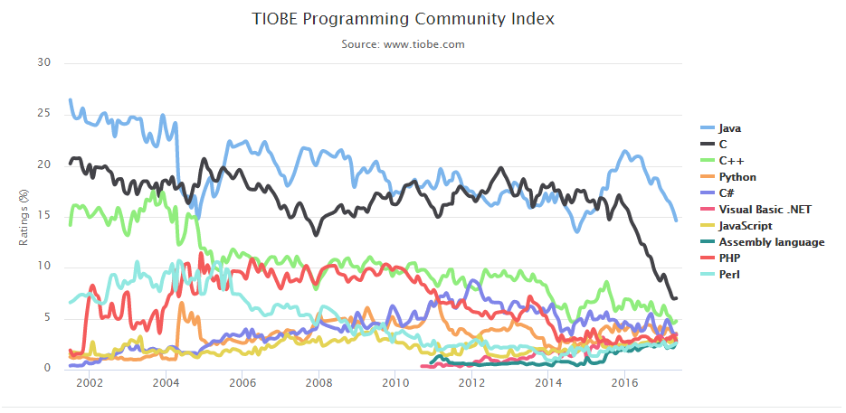
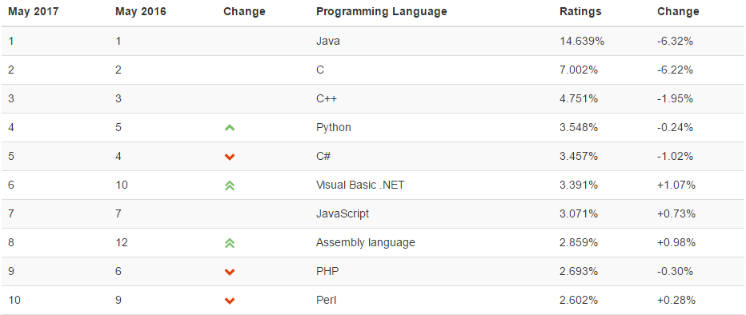

Python是著名的“龟叔”Guido van Rossum在1989年圣诞节期间，为了打发无聊的圣诞节而编写的一个编程语言。

现在，全世界差不多有600多种编程语言，但流行的编程语言也就那么20来种。如果你听说过TIOBE排行榜，你就能知道编程语言的大致流行程度。这是最近10年最常用的10种编程语言的变化图：

总的来说，这几种编程语言各有千秋。C语言是可以用来编写操作系统的贴近硬件的语言，所以，C语言适合开发那些追求运行速度、充分发挥硬件性能的程序。而Python是用来编写应用程序的高级编程语言。

当你用一种语言开始作真正的软件开发时，你除了编写代码外，还需kkkkk龟叔给Python的定位是“优雅”、“明确”、“简单”，所以Python程序看上去总是简单易懂，初学者学Python，不但入门容易，而且将来深入下去，可以编写那些非常非常复杂的程序。

总的来说，Python的哲学就是简单优雅，尽量写容易看明白的代码，尽量写少的代码。如果一个资深程序员向你炫耀他写的晦涩难懂、动不动就几万行的代码，你可以尽情地嘲笑他。

那Python适合开发哪些类型的应用呢？

首选是网络应用，包括网站、后台服务等等；

其次是许多日常需要的小工具，包括系统管理员需要的脚本任务等等；

另外就是把其他语言开发的程序再包装起来，方便使用。

最后说说Python的缺点。

任何编程语言都有缺点，Python也不例外。优点说过了，那Python有哪些缺点呢？

第一个缺点就是运行速度慢，和C程序相比非常慢，因为Python是解释型语言，你的代码在执行时会一行一行地翻译成CPU能理解的机器码，这个翻译过程非常耗时，所以很慢。而C程序是运行前直接编译成CPU能执行的机器码，所以非常快。

但是大量的应用程序不需要这么快的运行速度，因为用户根本感觉不出来。例如开发一个下载MP3的网络应用程序，C程序的运行时间需要0.001秒，而Python程序的运行时间需要0.1秒，慢了100倍，但由于网络更慢，需要等待1秒，你想，用户能感觉到1.001秒和1.1秒的区别吗？这就好比F1赛车和普通的出租车在北京三环路上行驶的道理一样，虽然F1赛车理论时速高达400公里，但由于三环路堵车的时速只有20公里，因此，作为乘客，你感觉的时速永远是20公里。

第二个缺点就是代码不能加密。如果要发布你的Python程序，实际上就是发布源代码，这一点跟C语言不同，C语言不用发布源代码，只需要把编译后的机器码（也就是你在Windows上常见的xxx.exe文件）发布出去。要从机器码反推出C代码是不可能的，所以，凡是编译型的语言，都没有这个问题，而解释型的语言，则必须把源码发布出去。

这个缺点仅限于你要编写的软件需要卖给别人挣钱的时候。好消息是目前的互联网时代，靠卖软件授权的商业模式越来越少了，靠网站和移动应用卖服务的模式越来越多了，后一种模式不需要把源码给别人。

再说了，现在如火如荼的开源运动和互联网自由开放的精神是一致的，互联网上有无数非常优秀的像Linux一样的开源代码，我们千万不要高估自己写的代码真的有非常大的“商业价值”。那些大公司的代码不愿意开放的更重要的原因是代码写得太烂了，一旦开源，就没人敢用他们的产品了。

当然，Python还有其他若干小缺点，请自行忽略，就不一一列举了。

同java和php一样，也是一门编程语言，诞生于1991年，具有丰富和强大的库。它常被昵称为胶水语言，能够把用其他语言制作的各种模块（尤其是C/C++）很轻松地联结在一起。目前开发语言排行榜排第五。

在国外很火，google的技术人员基本上都会用python，多用于开发web网站后台，搜素引擎爬虫，服务器集群自动化管理等，因其开发速度快，语法学习简单，生产效率高，这两年在国内上升速度非常快。