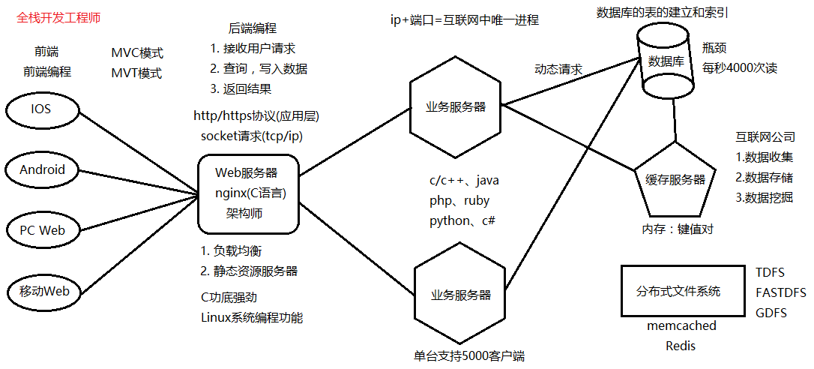

最早的软件都是运行在大型机上的，软件使用者通过“哑终端”登陆到大型机上去运行软件。后来随着PC机的兴起，软件开始主要运行在桌面上，而数据库这样的软件运行在服务器端，这种Client/Server模式简称CS架构。

随着互联网的兴起，人们发现，CS架构不适合Web，最大的原因是Web应用程序的修改和升级非常迅速，而CS架构需要每个客户端逐个升级桌面App，因此，Browser/Server模式开始流行，简称BS架构。

在BS架构下，客户端只需要浏览器，应用程序的逻辑和数据都存储在服务器端。浏览器只需要请求服务器，获取Web页面，并把Web页面展示给用户即可。

当然，Web页面也具有极强的交互性。由于Web页面是用HTML编写的，而HTML具备超强的表现力，并且，服务器端升级后，客户端无需任何部署就可以使用到新的版本，因此，BS架构迅速流行起来。

今天，除了重量级的软件如Office，Photoshop等，大部分软件都以Web形式提供。比如，新浪提供的新闻、博客、微博等服务，均是Web应用。

Web应用开发可以说是目前软件开发中最重要的部分。Web开发也经历了好几个阶段：

1. 静态Web页面：由文本编辑器直接编辑并生成静态的HTML页面，如果要修改Web页面的内容，就需要再次编辑HTML源文件，早期的互联网Web页面就是静态的；
2. CGI：由于静态Web页面无法与用户交互，比如用户填写了一个注册表单，静态Web页面就无法处理。要处理用户发送的动态数据，出现了Common Gateway Interface，简称CGI，用C/C++编写。
3. ASP/JSP/PHP：由于Web应用特点是修改频繁，用C/C++这样的低级语言非常不适合Web开发，而脚本语言由于开发效率高，与HTML结合紧密，因此，迅速取代了CGI模式。ASP是微软推出的用VBScript脚本编程的Web开发技术，而JSP用Java来编写脚本，PHP本身则是开源的脚本语言。
4. MVC：为了解决直接用脚本语言嵌入HTML导致的可维护性差的问题，Web应用也引入了Model-View-Controller的模式，来简化Web开发。ASP发展为ASP.Net，JSP和PHP也有一大堆MVC框架。

目前，Web开发技术仍在快速发展中，异步开发、新的MVVM前端技术层出不穷。

Python的诞生历史比Web还要早，由于Python是一种解释型的脚本语言，开发效率高，所以非常适合用来做Web开发。

Python有上百种Web开发框架，有很多成熟的模板技术，选择Python开发Web应用，不但开发效率高，而且运行速度快。

本章我们会详细讨论Python Web开发技术。

### 服务器架构

### 系统架构图

