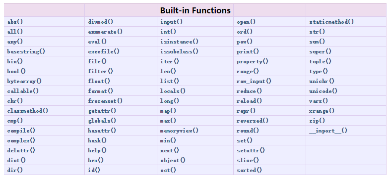

我们知道圆的面积计算公式为：

$$S = πr^2$$

当我们知道半径`r`的值时，就可以根据公式计算出面积。假设我们需要计算3个不同大小的圆的面积：

```
r1 = 12.34
r2 = 9.08
r3 = 73.1
s1 = 3.14 * r1 * r1
s2 = 3.14 * r2 * r2
s3 = 3.14 * r3 * r3
```

当代码出现有规律的重复的时候，你就需要当心了，每次写`3.14 * x * x`不仅很麻烦，而且，如果要把`3.14`改成`3.14159265359`的时候，得全部替换。

有了函数，我们就不再每次写`s = 3.14 * x * x`，而是写成更有意义的函数调用`s = area_of_circle(x)`，而函数`area_of_circle`本身只需要写一次，就可以多次调用。

基本上所有的高级语言都支持函数，Python也不例外。Python不但能非常灵活地定义函数，而且本身内置了很多有用的函数，可以直接调用。

### 抽象

抽象是数学中非常常见的概念。举个例子：

计算数列的和，比如：`1 + 2 + 3 + ... + 100`，写起来十分不方便，于是数学家发明了求和符号∑，可以把`1 + 2 + 3 + ... + 100`记作：

$$\sum_{n=1}^{100} n$$

这种抽象记法非常强大，因为我们看到∑就可以理解成求和，而不是还原成低级的加法运算。

而且，这种抽象记法是可扩展的，比如：

$$\sum_{n=1}^{100} (n^2 + 1)$$

还原成加法运算就变成了：

(1 x 1 + 1) + (2 x 2 + 1) + (3 x 3 + 1) + ... + (100 x 100 + 1)

可见，借助抽象，我们才能不关心底层的具体计算过程，而直接在更高的层次上思考问题。

写计算机程序也是一样，函数就是最基本的一种代码抽象的方式。

## 数学函数

| 函数              | 返回值 ( 描述 )                               |
| :-------------- | :--------------------------------------- |
| abs(x)          | 返回数字的绝对值，如abs(10)，返回 10                  |
| ceil(x)         | 返回数字的上入整数，如math.ceil(4.1) 返回 5           |
| cmp(x, y)       | 如果 x < y 返回 1,如果 x == y 返回 0, 如果 x > y 返回 1 |
| exp(x)          | 返回e的x次幂(ex),如math.exp(1) 返回2.718281828459045 |
| fabs(x)         | 返回数字的绝对值，如math.fabs(10)，返回10.0           |
| floor(x)        | 返回数字的下舍整数，如math.floor(4.9)返回 4           |
| log(x)          | 如math.log(math.e)返回1.0,math.log(100,10)返回2.0 |
| log10(x)        | 返回以10为基数的x的对数，如math.log10(100)返回 2.0     |
| max(x1, x2,...) | 返回给定参数的最大值，参数可以为序列。                      |
| min(x1, x2,...) | 返回给定参数的最小值，参数可以为序列。                      |
| modf(x)         | 返回x的整数部分与小数部分，两部分的数值符号与x相同，整数部分以浮点型表示。   |
| pow(x, y)       | x**y 运算后的值。                              |
| round(x [,n])   | 返回浮点数x的四舍五入值，如给出n值，则代表舍入到小数点后的位数。        |
| sqrt(x)         | 返回数字x的平方根，数字可以为负数，返回类型为实数，如math.sqrt(4)返回 2+0j |

## 随机数函数

随机数可以用于数学，游戏，安全等领域中，还经常被嵌入到算法中，用以提高算法效率，并提高程序的安全性。

| 函数                                | 描述                                       |
| :-------------------------------- | :--------------------------------------- |
| choice(seq)                       | 从序列的元素中随机挑选一个元素，比如random.choice(range(10))，从0到9中随机挑选一个整数。 |
| randrange ([start,] stop [,step]) | 从指定范围内，按指定基数递增的集合中获取一个随机数，基数缺省值为1        |
| random()                          | 随机生成下一个实数，它在[0,1)范围内。                    |
| seed([x])                         | 改变随机数生成器的种子seed。如果你不了解其原理，你不必特别去设定seed，Python会帮你选择seed。 |
| shuffle(lst)                      | 将序列的所有元素随机排序                             |
| uniform(x, y)                     | 随机生成下一个实数，它在[x,y]范围内。                    |

## 小结

### 内置函数



Built-in Functions

| [`abs()`](https://docs.python.org/2/library/functions.html#abs) | [`divmod()`](https://docs.python.org/2/library/functions.html#divmod) | [`input()`](https://docs.python.org/2/library/functions.html#input) | [`open()`](https://docs.python.org/2/library/functions.html#open) | [`staticmethod()`](https://docs.python.org/2/library/functions.html#staticmethod) |
| :---------------------------------------- | :---------------------------------------- | :---------------------------------------- | :---------------------------------------- | :---------------------------------------- |
| [`all()`](https://docs.python.org/2/library/functions.html#all) | [`enumerate()`](https://docs.python.org/2/library/functions.html#enumerate) | [`int()`](https://docs.python.org/2/library/functions.html#int) | [`ord()`](https://docs.python.org/2/library/functions.html#ord) | [`str()`](https://docs.python.org/2/library/functions.html#str) |
| [`any()`](https://docs.python.org/2/library/functions.html#any) | [`eval()`](https://docs.python.org/2/library/functions.html#eval) | [`isinstance()`](https://docs.python.org/2/library/functions.html#isinstance) | [`pow()`](https://docs.python.org/2/library/functions.html#pow) | [`sum()`](https://docs.python.org/2/library/functions.html#sum) |
| [`basestring()`](https://docs.python.org/2/library/functions.html#basestring) | [`execfile()`](https://docs.python.org/2/library/functions.html#execfile) | [`issubclass()`](https://docs.python.org/2/library/functions.html#issubclass) | [`print()`](https://docs.python.org/2/library/functions.html#print) | [`super()`](https://docs.python.org/2/library/functions.html#super) |
| [`bin()`](https://docs.python.org/2/library/functions.html#bin) | [`file()`](https://docs.python.org/2/library/functions.html#file) | [`iter()`](https://docs.python.org/2/library/functions.html#iter) | [`property()`](https://docs.python.org/2/library/functions.html#property) | [`tuple()`](https://docs.python.org/2/library/functions.html#tuple) |
| [`bool()`](https://docs.python.org/2/library/functions.html#bool) | [`filter()`](https://docs.python.org/2/library/functions.html#filter) | [`len()`](https://docs.python.org/2/library/functions.html#len) | [`range()`](https://docs.python.org/2/library/functions.html#range) | [`type()`](https://docs.python.org/2/library/functions.html#type) |
| [`bytearray()`](https://docs.python.org/2/library/functions.html#bytearray) | [`float()`](https://docs.python.org/2/library/functions.html#float) | [`list()`](https://docs.python.org/2/library/functions.html#list) | [`raw_input()`](https://docs.python.org/2/library/functions.html#raw_input) | [`unichr()`](https://docs.python.org/2/library/functions.html#unichr) |
| [`callable()`](https://docs.python.org/2/library/functions.html#callable) | [`format()`](https://docs.python.org/2/library/functions.html#format) | [`locals()`](https://docs.python.org/2/library/functions.html#locals) | [`reduce()`](https://docs.python.org/2/library/functions.html#reduce) | [`unicode()`](https://docs.python.org/2/library/functions.html#unicode) |
| [`chr()`](https://docs.python.org/2/library/functions.html#chr) | [`frozenset()`](https://docs.python.org/2/library/functions.html#func-frozenset) | [`long()`](https://docs.python.org/2/library/functions.html#long) | [`reload()`](https://docs.python.org/2/library/functions.html#reload) | [`vars()`](https://docs.python.org/2/library/functions.html#vars) |
| [`classmethod()`](https://docs.python.org/2/library/functions.html#classmethod) | [`getattr()`](https://docs.python.org/2/library/functions.html#getattr) | [`map()`](https://docs.python.org/2/library/functions.html#map) | [`repr()`](https://docs.python.org/2/library/functions.html#func-repr) | [`xrange()`](https://docs.python.org/2/library/functions.html#xrange) |
| [`cmp()`](https://docs.python.org/2/library/functions.html#cmp) | [`globals()`](https://docs.python.org/2/library/functions.html#globals) | [`max()`](https://docs.python.org/2/library/functions.html#max) | [`reversed()`](https://docs.python.org/2/library/functions.html#reversed) | [`zip()`](https://docs.python.org/2/library/functions.html#zip) |
| [`compile()`](https://docs.python.org/2/library/functions.html#compile) | [`hasattr()`](https://docs.python.org/2/library/functions.html#hasattr) | [`memoryview()`](https://docs.python.org/2/library/functions.html#func-memoryview) | [`round()`](https://docs.python.org/2/library/functions.html#round) | [`__import__()`](https://docs.python.org/2/library/functions.html#__import__) |
| [`complex()`](https://docs.python.org/2/library/functions.html#complex) | [`hash()`](https://docs.python.org/2/library/functions.html#hash) | [`min()`](https://docs.python.org/2/library/functions.html#min) | [`set()`](https://docs.python.org/2/library/functions.html#func-set) |                                          |
| [`delattr()`](https://docs.python.org/2/library/functions.html#delattr) | [`help()`](https://docs.python.org/2/library/functions.html#help) | [`next()`](https://docs.python.org/2/library/functions.html#next) | [`setattr()`](https://docs.python.org/2/library/functions.html#setattr) |                                          |
| [`dict()`](https://docs.python.org/2/library/functions.html#func-dict) | [`hex()`](https://docs.python.org/2/library/functions.html#hex) | [`object()`](https://docs.python.org/2/library/functions.html#object) | [`slice()`](https://docs.python.org/2/library/functions.html#slice) |                                          |
| [`dir()`](https://docs.python.org/2/library/functions.html#dir) | [`id()`](https://docs.python.org/2/library/functions.html#id) | [`oct()`](https://docs.python.org/2/library/functions.html#oct) | [`sorted()`](https://docs.python.org/2/library/functions.html#sorted) |                                          |

### 常用函数

| 方法声明         | 功能描述               |
| :----------- | :----------------- |
| type()       | 获取一个类或变量的类型        |
| id()         | 判断两个变量是否为同⼀个值的引⽤   |
| isinstance() | 判断一个实例是否是某个类型      |
| abs()        | 绝对值                |
| cmp()        | 比较                 |
| sum()        | 求和                 |
| max()        | 最大值                |
| min()        | 最小值                |
| list()       |                    |
| range()      |                    |
| del()        | 删除                 |
| enumerate()  | 把一个list变成索引-元素对，遍历 |
| sort()       | 排序                 |
